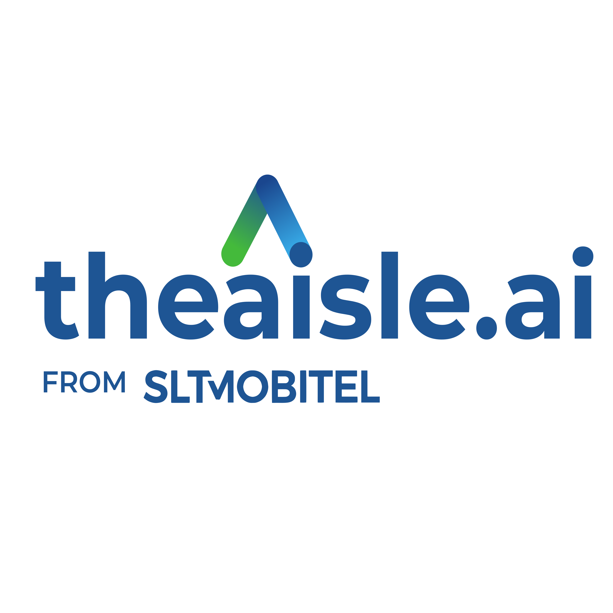

<h1 align="center">
    ASK Finance Assistant
</h1> 

The assistant supports **Sinhala, English, Tamil, Thai, and Chinese**, ensuring broad accessibility for both local and international visitors.

  

## Documentation

### Development and Deployment
For development purposes, build the application from scratch in your own pc by following this documentation and start working on it.
- [Build and Start Development Enviornment](https://github.com/SLTDigitalLab/ask_hr_api/blob/main/documentation/dev.md)

For deployment purposes, build the application in the server and necessary changes as mentioned in this documentation.
- [Build and Start Deployment Enviornment](documentation/deployment.md)

### Structure of RAG Pipeline

The rag pipeline is implemented in a class called `basemodel` seperate componets perform tasks like retrieval, augmentation and generation. Follow along with link for more information.
- [BaseModel](https://github.com/SLTDigitalLab/EKB-API/blob/dev/documentation/basemodel.md)

### Structure of API Endpoint
The API provides a collection of endpoints covering system operations, multilingual chat, and document management.  
For the full reference :  

- [API Endpoints](documentation/endpoints.md)

### Setting up Evaluations

Langsmith is used as the evaluation monitoring tool. The below documentation provides the way to setup the evaluation's from the langsmith traces.

- [LangSmith Evaluation](documentation/evaluation.md)

### Setting up Monitoring Tools

We make use of `grafana` and `prometheaus` to provide monitoring and alerting functionality for deployment environment. Follow up with the link to setup the containers.

- [Build Setup](https://github.com/SLTDigitalLab/EKB-API/blob/dev/documentation/monitor.md)

