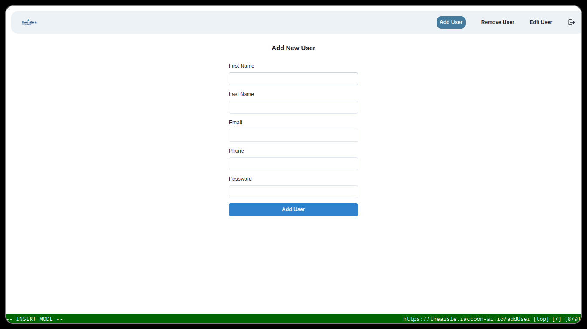
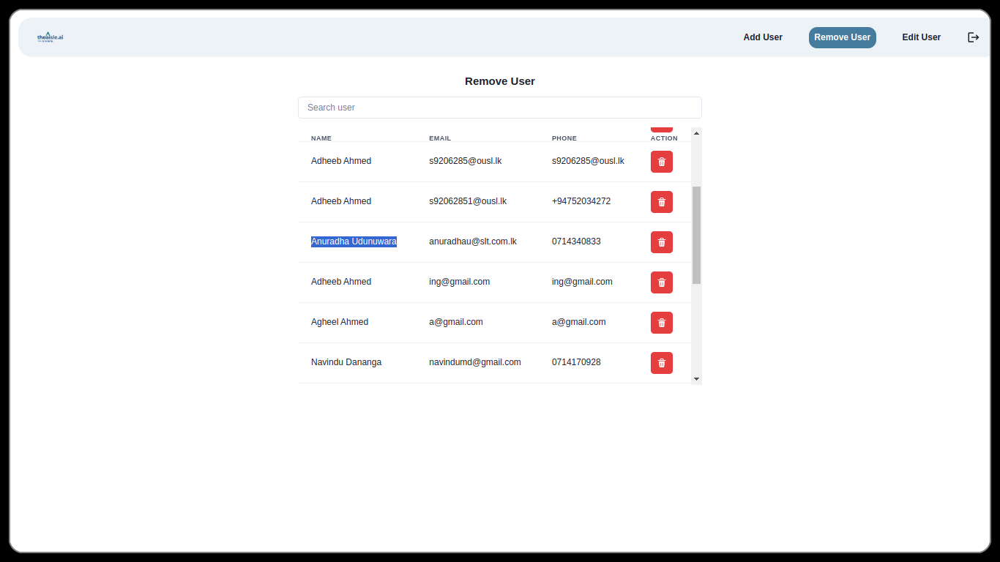
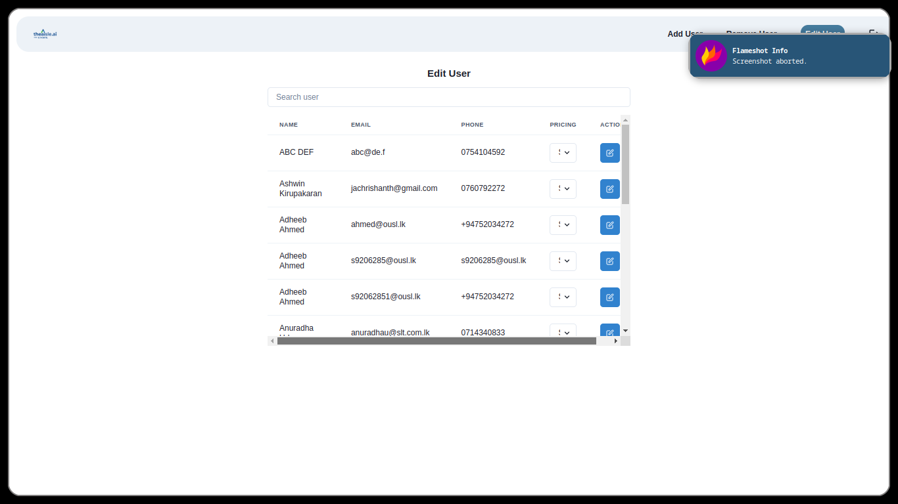

## Admin Manual

This section comprises of information related to how admins can interact with the application to get the most out of it.


### Login / Register

- After visiting `https://theaisle.raccoon-ai.io/` a button `login`  can be found at the top of the navigation bar. Choose login and enter the following credentials.

```
Email : supervadmin@slt.com
Password: starlego4540
```

**Step-01**
<p align="center">
  
</p>

- Enter your credentials in the form for logging in.

**Step-02**
<p align="center">
  
</p>


## Create Users
- On successful login admins will be redirected user creation page, where they can create new users by entering thier details.

<p align="center">
  
</p>


## Remove Users
- To remove users, admins can visit `remove users` page.

<p align="center">
  
</p>


## Modify Users

- For modifying user information, admins can visit `edit user` page.

<p align="center">
  
</p>

