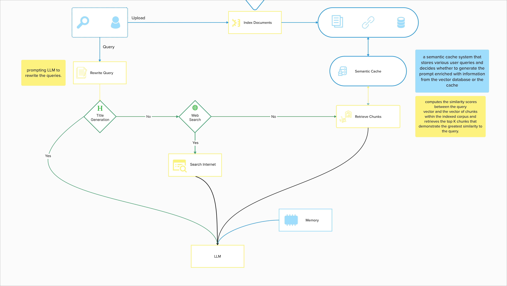

# BaseModel Class

## Overview
`BaseModel` is designed to handle various functionalities including database initialization, prompt setup based on chat mode, title generation, and document retrieval either from a web search or local collections. The class supports long short and header prompt types and integrates with Qdrant for vector-based retrieval.

  

## Attributes
- `current_user`: The ID of the current user.
- `chat_id`: The chat session ID.
- `websearch`: Boolean indicating if web search is enabled.
- `context`: The mode of chat, either 'long' or 'short'.
- `host`: The host for the vector database, either 'localhost' or 'vector-db'.
- `db`: The database connection instance.
- `prompt`: The prompt template based on the chat mode.
- `qs`: The query service for document retrieval.

## Methods

### `__init__(self, current_user, collection, web_search, chat_mode, chat_id, source_documents=False, collection_mode=False)`
Initializes the `BaseModel` class with necessary parameters and setups.

### `get_history(self)`
Retrieves the previous chat questions and answers related to the current chat session.

**Returns:**
- `formatted_history` (array): String array with the chat messages.

### `generate_header(self, state)`
Generates a title to a chat session summarizing the first question and answer

**Args:**
- `state` (dict): The current graph state.

**Returns:**
- `state` (dict): Updated state with a new key `generation` containing the generated title.

### `generate(self, state)`
Generates an answer based on the current state of the graph.

**Args:**
- `state` (dict): The current graph state.

**Returns:**
- `state` (dict): Updated state with a new key `generation` containing the generated answer.

### `web_search(self, state)`
Performs a web search using the Tavily API based on the question in the current state.

**Args:**
- `state` (dict): The current graph state.

**Returns:**
- `state` (dict): Updated state with appended web results in the `documents` key.

### `second_point(self, state)`
Resets the `documents` key in the state.

**Args:**
- `state` (dict): The current graph state.

**Returns:**
- `state` (dict): Updated state with `documents` key reset.

### `third_point(self, state)`
Placeholder method that returns the state as is.

**Args:**
- `state` (dict): The current graph state.

**Returns:**
- `state` (dict): The unchanged state.

### `check_search(self, state)`
Checks if the web search is enabled.

**Args:**
- `state` (dict): The current graph state.

**Returns:**
- `bool`: True if web search is enabled, else False.

### `check_header(self, state)`
Check whether the chat mode is header generation.

**Args:**
- `state` (dict): The current graph state.

**Returns:**
- `bool`: True if chat mode is header, else False.

### `_generate(self, question)`
Main method to generate a response based on the question. It detects the language of the question and processes it through a state graph workflow.

**Args:**
- `question` (str): The input question.

**Returns:**
- `Success` or `Error`: Response indicating the result of the operation.
