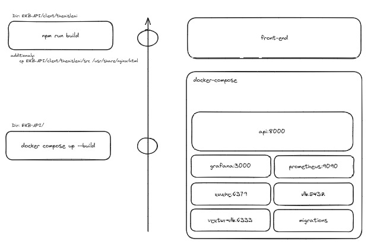

## Build Deployment Enviornment

### Deployment Workflow 

<p align="center">
  
</p>


### Front-end

- Navigate to the `EKB-API/client/theaisleai/src/urls.js`file and change the *BASE_URL* according to the server
- Navigate to the frond-end directory
    ```bash
    cd EKB-API/client/theaisleai
    ```
- Build the app
    ```bash
    npm run build
    ```
- Naviagete to the `src` dir
    ```bash
    cd src
    ```
- Copy the built files into nginx dir
    ```bash
    cp -r * /etc/nginx/sites-available/default
    ```
- If the `default` is not a directory navigate to the `dist` directory
    ```bash
    cd EKB-API/client/theaisleai/dist
    ```
    - In the EKB-staging server copy the files as below
    ```bash
    cp -r * /usr/share/nginx/html
    ```
    - In the mobitel server copy as below
    ```bash
    cp -r * /var/www/html
    ```

### Backend

- Change the variable `server` of `mode.py` in `app/` from `false` to `true`
- Change the variable `staging` of `mode.py` in `app/`
    - If the staging server
        ```bash
        staging = True
        ```
    - If the mobitel server
        ```bash
        staging = False
        ```
- Modify the `app/db/database.ini` and make the following changes
    - postgres host should be `db` instead of `localhost`
    - redis host should be `cache` instead of `localhost`
- Move the current `docker-compose.yml` to `compose/dev` and move `compose/prod/docker-compose.yml` back to root directory.
- `docker-compose.yml`: In the api container change the image volume path as below
    - In EKB-staging server:
    ```bash
    - /home/user/stores/images/:/build/app/stores/images/
    ```
    - In mobitel server:
    ```bash
    - /var/www/html/images/:/build/app/stores/images/
    ```
### Environment File Setup
- Create a .env file in the root of your project
    ```bash
    - nano .env
    ```
    - content
    ```bash
        TAVILY_API_KEY = project_tavily_api_key
        GOOGLE_API_KEY = project_google_api_key
        OPENAI_API_KEY = project_openai_api_key
        LANGCHAIN_TRACING_V2 = "true"
        LANGCHAIN_API_KEY = project_langsmith_api_key
        LANGCHAIN_PROJECT = "virtual_city_of_kandy"
        TRAVELPAYOUTS_MARKER = project_marker
        TRAVELPAYOUTS_TOKEN = project_travelpayouts_token
        VECTORSTORE_PROD_URL = project_vectorstore_prod_url
        VECTORSTORE_DEV_URL = project_vectorstore_dev_url
        DEFAULT_GEMINI_EMBEDDING_MODEL = project_gemini_embedding_model
        VECTORSTORE_DIM = 768
        VECTORSTORE_NAME = "virtual_city"
    ```

### Nginx Configuration
- Create and edit config file
    ```bash
    - sudo nano /etc/nginx/sites-available/aisleprojects
    ```
- Enable the site
    ```bash
    - sudo ln -s /etc/nginx/sites-available/aisleprojects /etc/nginx/sites-enabled/
    ```
- Test configuration
    ```bash
    - sudo nginx -t
    ```
- Restart Nginx
    ```bash
    - sudo systemctl restart nginx
    ```


  
