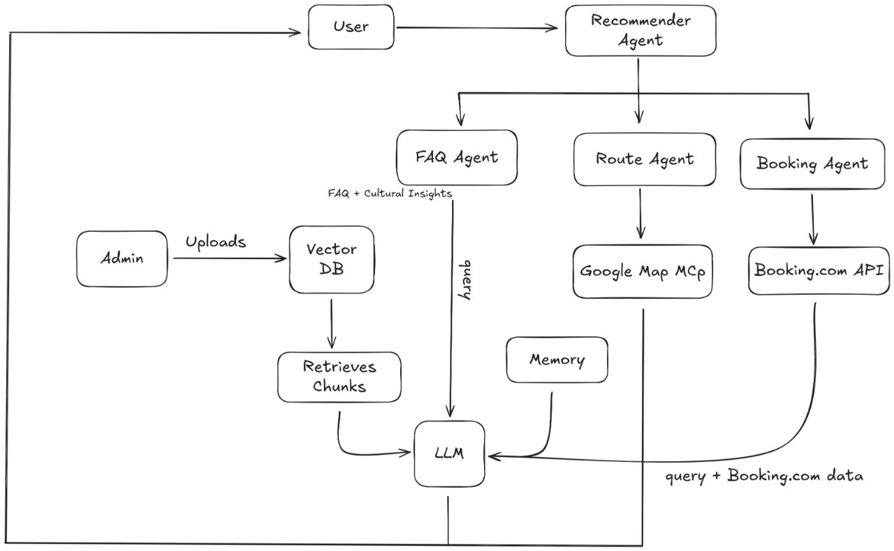

## Build Development Environment

<p align="center">
  
</p>

### Back-end

* Note: Use Python 3.11

- Clone this git repo

    ```bash
    git clone https://github.com/SLTDigitalLab/ask_hr_api.git
    ```
- Navigate to cloned directory

    ```bash
    cd ask_hr_api
    ```
- Create and activate a virtual environment [Documentation](https://docs.python.org/3/library/venv.html)
    ```bash
    # Step - 01
    python -m venv venv
    # Step - 02
    .venv\Scripts\Activate.ps1 # Windows - Powershell
    ```
- Install Back-end dependencies (Consider removing uviloop-> (winloop),triton from `cleaned_requirements.txt` if you are using windows.)

    ```bash
    python requirements_annotator.py
    ```

    ```bash
    pip install -r cleaned_requirements.txt
    ```
    ```bash
    python -m spacy download en_core_web_sm
    ```
- Create a `.env` file in the root directory and add the following values:
  ```ini
  TAVILY_API_KEY=
  GOOGLE_API_KEY=
  OPENAI_API_KEY=
  LANGCHAIN_TRACING_V2=
  LANGCHAIN_API_KEY=
  LANGCHAIN_PROJECT=
  TRAVELPAYOUTS_MARKER=
  TRAVELPAYOUTS_TOKEN=
  VECTORSTORE_PROD_URL=
  VECTORSTORE_DEV_URL=
  DEFAULT_GEMINI_EMBEDDING_MODEL=
  VECTORSTORE_DIM=
  VECTORSTORE_NAME=
  ```

### Front-end

- Make sure that latest version of nodejs is avaialable.
- Navigate to the frond-end directory
    ```bash
    cd ask_hr_api/client/theaisleai
    ```
- Install necessary dependenciese
    ```bash
    npm install
    ```

### Build the Containers
- Up the containers

    ```bash
    docker compose up --build
    ```
## Start Development Environment

### Front-end
- Navigate to the frond-end directory
    ```bash
    cd ask_hr_api/client/theaisleai
    ```
- Start the app
    ```bash
    npm run dev
    ```
### Back-end
- Navigate to the directory
    ```bash
    cd ask_hr_api/app
    ```
- Start the backend server
    ```bash
    uvicorn main:app --reload
    ```

### Start the Containers
- Up the containers

    ```bash
    docker compose up
    ```
