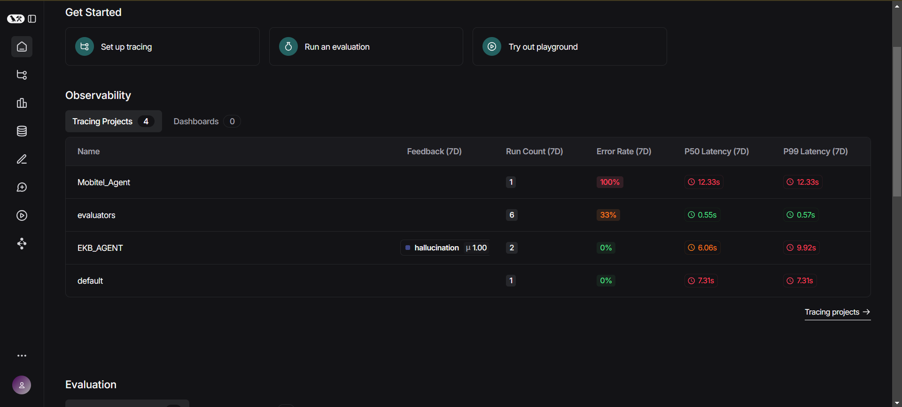

# Evaluations

## Overview

Langsmith traces each llm operation done in the chat API. This traces are stored in the projects section of the LangSmith dashboard. After each trace the evaluations will be done. The evaluation matrices should be setup as follow.

## Set up Evaluation matrices.

1. Select the relevant project

  

2. Select Add Rules

  

3. Give a relevant name and select `LLM-as-judge-evaluator`

  

4. Select the LLM to calculate the metrics. Then select the suggested evaluator prompt.

  

5. Set the LLM's API key

  

6. Select the relevant metrics

  

7. Set the relevant inputs to the prompt template and continue

  

