## User Manual

This section comprises of information related to how users can interact with the application to get the most out of it.

### Login / Register

- After entering `https://theaisle.raccoon-ai.io/` a button `login` or `register` can be found at the top of the navigation bar. Choose appropriate page as per the need.

**Step-01**

  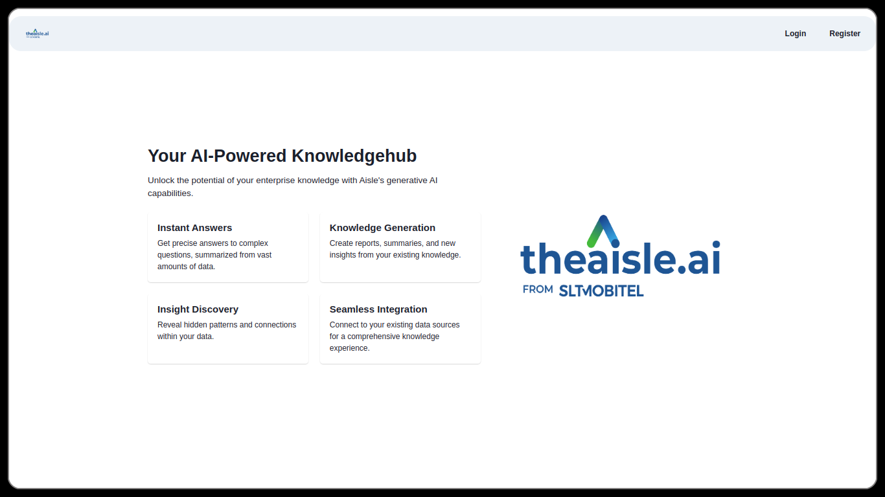

- Enter your credentials in the form for logging in.

**Step-02**

  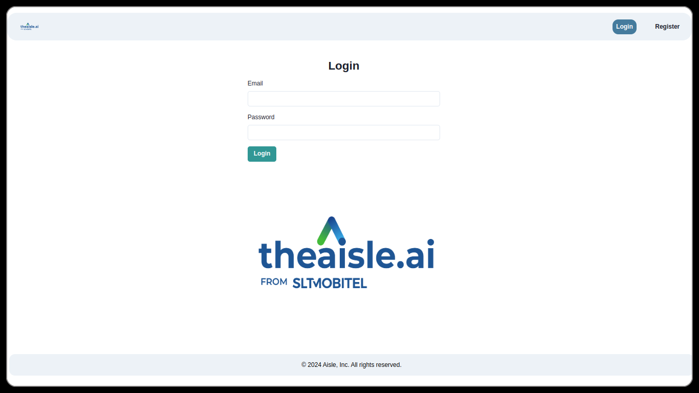

## Pricing
- On successful registration, users will be redirected to pricing page, where they will have to choose a suitable subscription based on their need.

  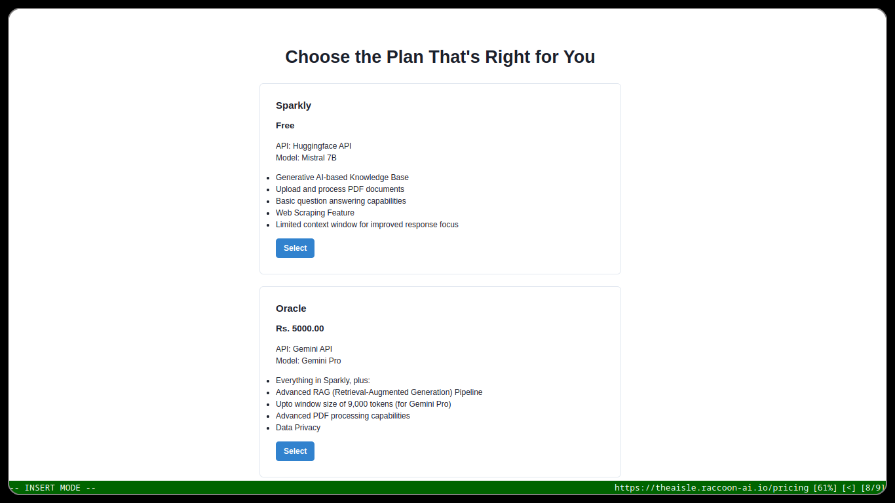

## Chat
- On successful subscription, users wil be redirected to chat interface where they will
    - Initially upload a document in the upload page.
    - Choose the uploaded document in the chat interface
    - Select a chat mode (Short/Long)
    - Start a session
    - And enter a query

  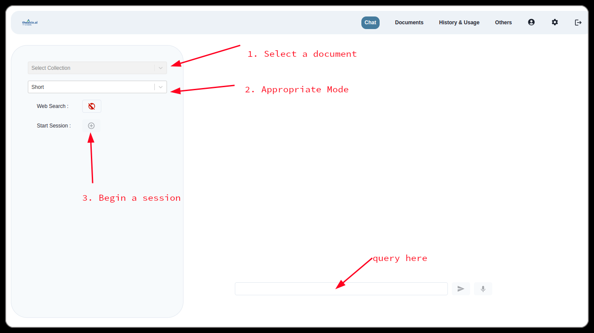

## Scrape

- For scraping pages from web, a user can choose scrape page, where he/she will be required to assign the document name and insert the link to be scraped.

  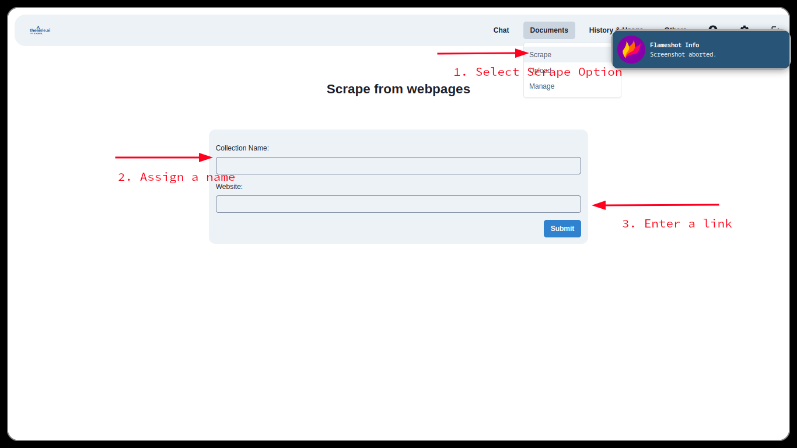

## Upload
- To upload documents to the knowledgehub, users will be required to use this page (`upload`) and select a pdf document along with it's name. These documents will be reflected in the chat interface for interaction.

  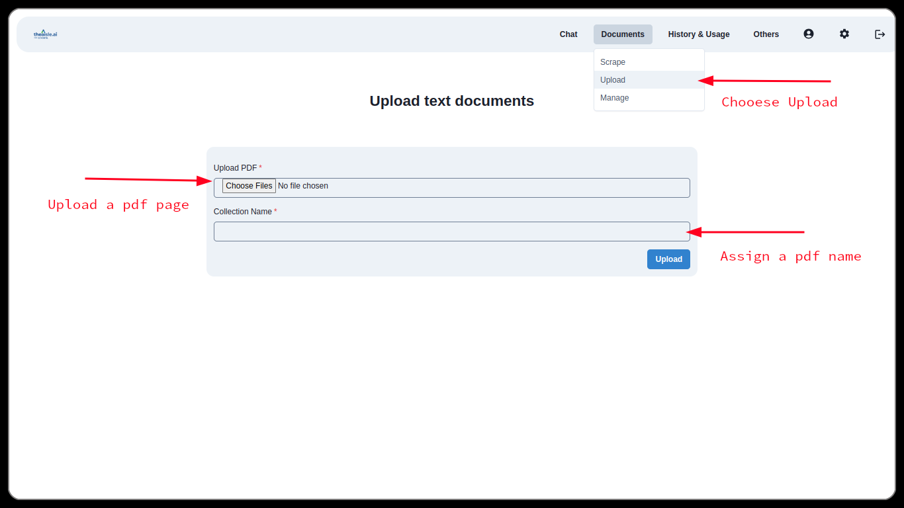

## Manage Documents

- To manage the uploaded documents users can go `manage` page where they can delete the documents.

  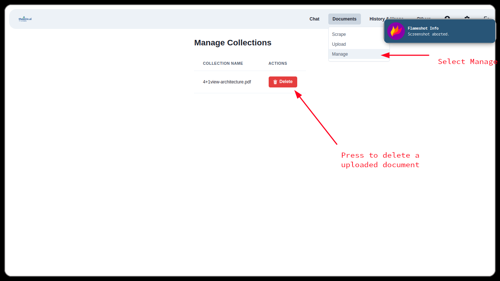

## Chat History

- To review and visit pst history sessions a user can visit `history` page. The page will reflect past history interactions.

  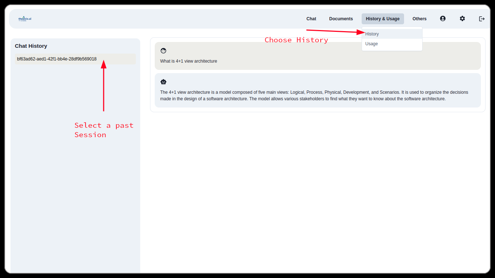

## Token Usage

- For inferecnce, the usage of tokens will be calculated and displayed in the `usage` page with some addtional information.

  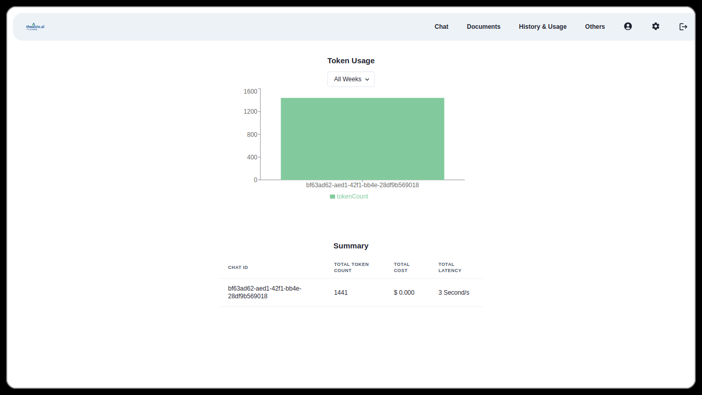

  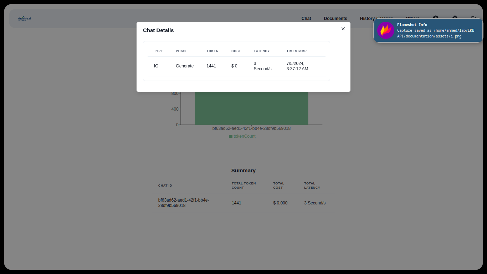

## Settings

- To modify personal information or switch subscriptions visit `settings` page.

  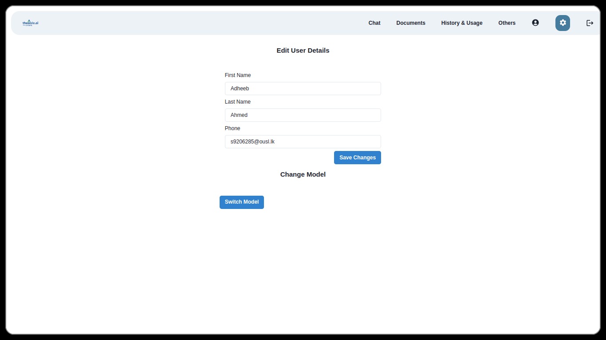

