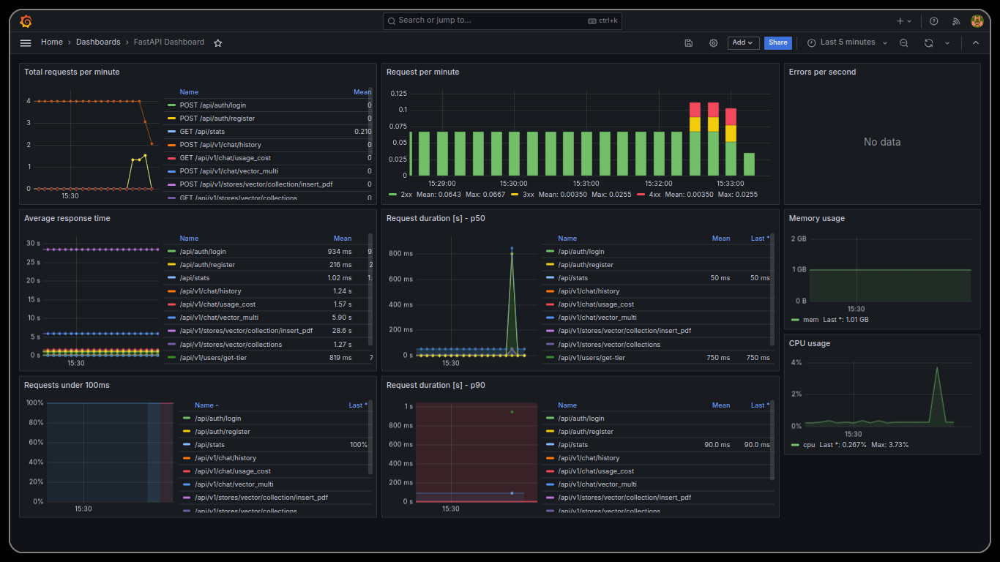

## Initial Setup

First thing to do after successfull deployment of all containers is to make sure that the dashboard is available for access at, `https://theaisle.raccoon-ai.io/api/stats`.

The [prometheusfastapi instrumentator](https://github.com/trallnag/prometheus-fastapi-instrumentator) class instantiated inside our backend sends information to the `prometheaus` container which becomes accessible for `grafana` to display the information on `/api/stats`.

After initial deployment, we can login to the platform using `admin` as username and password. Also one might wanna import the dashboard template from `grafana/fastapi-dashboard.json` to the grafana platform.

The dashboard might require further refinement for correctly displaying the information refer grafana [documentation](https://grafana.com/docs/grafana/latest/).

Correctly setup dashboard will look like this,

  

