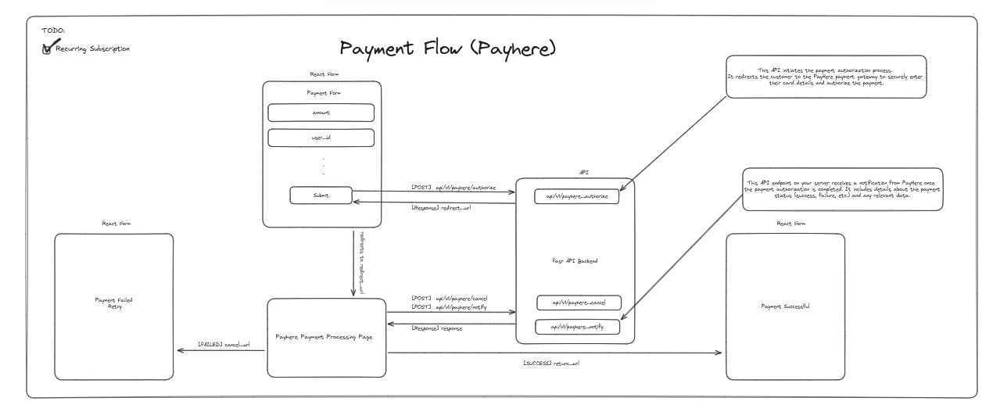

# PayHere Payment Gateway

## Overview

The payment gateway facilitates secure transactions using PayHere. It handles user information, order processing, and payment authorization, ensuring a smooth checkout experience.

  

## Development Workflow

1. **Frontend Implementation**:
    - **Location**: `client/theaisleai/src/pages/payherecheckout/PayHereCheckout.jsx`
    - Uses React for user interface and Axios for API requests.
    - Handles user input, form submission, and interacts with the backend for payment processing.

2. **Backend Implementation**:
    - **Location**: `app/routers/payment.py`
    - Utilizes FastAPI for creating API endpoints.
    - Manages payment authorization, notification, and cancellation.

## Attributes

- `MERCHANT_ID`: Merchant ID for PayHere.
- `MERCHANT_SECRET`: Secret key for PayHere.
- `generate_hash`: Function to generate secure hash for transactions.
- `authorize_payhere`: Endpoint to authorize payment.
- `notify_payhere`: Endpoint to handle payment notifications.
- `cancel_payhere`: Endpoint to handle payment cancellations.

## Methods

### `generate_hash(merchant_secret, merchant_id, order_id, amount, currency='LKR')`
Generates a secure hash for transaction validation.

**Args:**
- `merchant_secret` (str): The secret key of the merchant.
- `merchant_id` (str): The ID of the merchant.
- `order_id` (str): The order ID.
- `amount` (float): The transaction amount.
- `currency` (str): The currency code, default is 'LKR'.

**Returns:**
- `str`: The generated hash.

### 1. `/api/v1/payhere/authorize`

Authorizes a payment request by generating a hash needed for the PayHere checkout process.

#### Method
  - `generate_hash(merchant_secret, merchant_id, order_id, amount, currency='LKR')`

#### Request
- **Method:** `POST`
- **Headers:**
  - `Authorization`: Bearer token for authentication.
- **Args:**
    - `response` (Response): The response object.
    - `body` (PayhereAuthorizationModel): The request body.
    - `current_user` (User): The current user object.

### 2. `/api/v1/payhere/notify`

Receives notifications from PayHere regarding the payment status.
#### Method
  - `generate_hash(merchant_secret, merchant_id, order_id, amount, currency='LKR')`

#### Request
- **Method:** `POST`
- **Args:**
    - `response` (Response): The response object.
    - `body` (PayhereNotifyModel): The request body.

### 3. `/api/v1/payhere/cancel`

Handles payment cancellations when the user cancels the transaction on the PayHere payment page.
#### Method

  - `generate_hash(merchant_secret, merchant_id, order_id, amount, currency='LKR')`

#### Request
- **Method:** `POST`
- **Args:**
    - `response` (Response): The response object.
    - `body` (PayhereCancelModel): The request body.